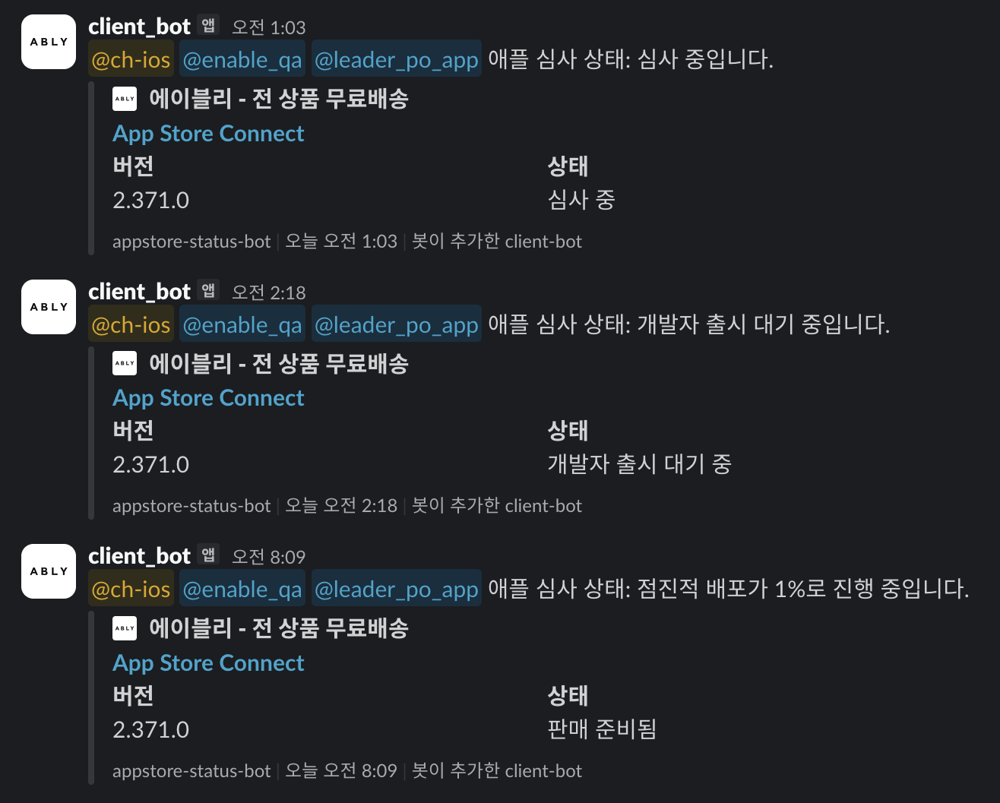

# appstore-status-bot

> update date: 2026-06-09

App Store Connect의 **앱 심사·배포 상태 변화를 감지해 Slack으로 알리는 봇**입니다.
순수 TypeScript로 App Store Connect REST API(JWT 인증)를 직접 호출하며, 런타임 의존성이 없습니다.

## 동작 방식

트리거: App Store 버전 생성(enforce_phased_release) 직후 repository_dispatch / 하트비트 cron(명목 5분, GitHub 스로틀로 실제 ~30-50분) / 수동 실행

1. 추적 윈도우 확인 — dispatch·수동이면 윈도우 오픈(기본 14일), schedule인데 윈도우가 닫혀 있으면 즉시 종료(폴링 안 함)
2. App Store Connect 조회 → 최신 버전의 심사 상태·점진적 배포 상태 정규화
3. 직전 상태(`state/status.json`)와 비교(diff) — 변화가 있을 때만 알림
4. Slack 전송 (심사 단계 / 점진적 배포 진행률)
5. 상태 저장. 모든 앱이 점진적 배포 완료되면 윈도우 닫음

핵심은 **심사가 진행되는 구간에만 폴링**한다는 점입니다. 윈도우가 닫혀 있으면 10분 cron이
즉시 종료하므로, 과거처럼 24시간 내내 도는 노이즈가 없습니다.

### 알림 메시지

- **심사 단계**: 제출 준비 중 / 심사 대기 중 / 심사 중 / 거부됨 / 메타데이터 거부됨 등
- **점진적 배포**: 1% → 2% → 5% → 10% → 20% → 50% → 100% 진행률, 완료/중단
- 메시지 앞에 지정한 Slack subteam을 멘션하고, App Store Connect 카드(버전·상태·아이콘)를 첨부

### 미리보기




## 환경변수 / 시크릿

GitHub Actions Secrets에 등록합니다.

| 키 | 설명 | 필수 |
|---|---|---|
| `KEY_ID` | App Store Connect API Key ID | ✅ |
| `ISSUER_ID` | App Store Connect Issuer ID | ✅ |
| `PRIVATE_KEY` | `.p8` 키 본문 (여러 줄 또는 `\n` 이스케이프 모두 지원) | ✅ |
| `BUNDLE_ID` | 대상 번들 ID (콤마로 여러 개 지정 가능) | ✅ |
| `SLACK_WEB_CLIENT_API_KEY` | Slack Bot 토큰 | ✅ |
| `CHANNEL_R` | 알림 채널 ID | ✅ |
| `MENTION_GROUP_IDS` | 멘션할 subteam ID 목록(콤마). 없으면 `GROUP_ID_P` 사용 | 선택 |
| `DRY_RUN` | `true`면 Slack 미발송(조회·판정만) | 선택 |
| `SUMMARY` | ASC 응답 로그. 기본 슬림 요약, `false`면 전체 raw 출력 | 선택 |

> CI에서 상태 파일 커밋에 쓰는 `GITHUB_TOKEN`은 자동 제공됩니다(워크플로우 `contents: write`).

## 트리거 연동

알림 대상은 **App Store 버전**이므로, TestFlight 배포가 아니라 App Store 버전이 생성되는
시점(iOS 릴리즈 워크플로우의 `enforce_phased_release` 직후)에 이 레포로 `repository_dispatch`를
보냅니다.

```yaml
# 발신 측 워크플로우 (예시)
- name: appstore-status-bot 트리거
  if: success()
  run: |
    curl -sf -X POST https://api.github.com/repos/banhala/appstore-status-bot/dispatches \
      -H "Authorization: Bearer ${{ secrets.ASC_BOT_DISPATCH_TOKEN }}" \
      -H "Accept: application/vnd.github+json" \
      -d "$(jq -n --arg v "$APP_VERSION" \
            '{event_type:"appstore-review-window", client_payload:{version:$v}}')"
```

`client_payload.releaseNote`를 함께 보내면 Slack 알림 thread에 release note가 답글로 붙습니다.

> 위 예시는 템플릿입니다. 실제 연결하려면 ① `$APP_VERSION`을 `Version.xcconfig` 등에서 주입,
> ② 이 레포에 `repository_dispatch` 권한(fine-grained PAT, `contents: write`)을 가진
> `ASC_BOT_DISPATCH_TOKEN` 시크릿을 **발신 레포**에 추가해야 합니다.
> `event_type`(`appstore-review-window`)은 `poll.yml`의 트리거와 일치합니다.

## 상태 저장

직전 상태는 레포의 [`state/status.json`](./state/status.json)에 저장합니다(외부 저장소 없음).
변화가 있을 때만 CI에서 커밋·푸시하며, 로컬 실행 시에는 파일만 갱신하고 커밋하지 않습니다.

## 로컬 실행 / 디버그

```bash
npm install

# dry 실행 (Slack 미발송, ASC 응답 슬림 요약 출력)
TRIGGER=workflow_dispatch DRY_RUN=true \
KEY_ID=... ISSUER_ID=... PRIVATE_KEY="$(cat AuthKey_XXXX.p8)" \
BUNDLE_ID=com.example.app \
SLACK_WEB_CLIENT_API_KEY=dummy CHANNEL_R=dummy \
npm start
# 전체 raw 응답을 보려면 SUMMARY=false 추가
```

`TRIGGER=workflow_dispatch`가 있어야 윈도우가 열려 폴링합니다. `DRY_RUN=true`면 알림은
콘솔에만 출력됩니다.

## 개발

```bash
npm run typecheck   # 타입 체크 (tsc --noEmit)
npm test            # 단위·통합 테스트 (vitest)
```

## 구조

```
src/
  index.ts          # 오케스트레이션 (윈도우 판정 → 조회 → diff → 알림 → 저장)
  config/env.ts     # 환경변수 로딩·검증
  asc/
    jwt.ts          # ES256 JWT 발급
    client.ts       # ASC REST 클라이언트
    appStatus.ts    # 버전 조회 + 상태 정규화
  diff/diff.ts      # 직전 상태 대비 변화 판정
  notify/
    messages.ts     # 상태 → 한국어 문구·라벨·색상
    slack.ts        # Slack 전송
  state/
    types.ts        # 상태 타입·enum
    store.ts        # status.json 로드/저장
state/status.json   # 추적 상태 저장 파일
.github/workflows/poll.yml
```
